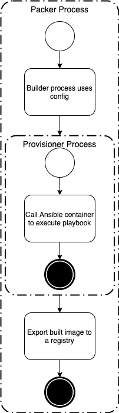

# Packer Ansible

This repo uses HCL instead of JSON templates to manage the packer build process. HCL provides greater control on dynamic logic for building different images. For the installation and configuration of the VM, Packer uses Ansible. Instead of the Ansible provisioner, this pattern uses Docker as the Ansible run time environment to invoke the playbook.



## Environment Variable

These are the environment variables to set before executing the Packer process. Some variables are required for specific builders and there are columns indicating which ones.

| Variable                            | Required   | Default Value               | Builder: ephemeral-ansible-agent | Builder: local-ansible-agent | Builder: local-ansible-agent-for-docker | AWS | Azure | VirtualBox | VMWare | Docker | Description                                                                                                                  |
| ----------------------------------- | ---------- | --------------------------- | -------------------------------- | ---------------------------- | --------------------------------------- | --- | ----- | ---------- | ------ | ------ | ---------------------------------------------------------------------------------------------------------------------------- |
| PKR_VAR_ansible_playbook_path       | Y          |                             |                                  | X                            | X                                       | X   | X     | X          | X      | X      | Ansible playbook path.                                                                                                       |
| PKR_VAR_aws_ami_regions             | Y          |                             | X                                | X                            | X                                       | X   |       |            |        |        | Region to store the AMI.                                                                                                     |
| PKR_VAR_container_registry_password | Y          |                             |                                  |                              | X                                       |     |       |            |        | X      | Container registry password.                                                                                                 |
| PKR_VAR_container_registry_server   | Y          |                             |                                  |                              | X                                       |     |       |            |        | X      | Container registry server url.                                                                                               |
| PKR_VAR_container_registry_username | Y          |                             |                                  |                              | X                                       |     |       |            |        | X      | Container registry username.                                                                                                 |
| PKR_VAR_container_repository        | Y          | https://index.docker.io/v1/ |                                  |                              | X                                       |     |       |            |        | X      | Docker repository to push built image to.                                                                                    |
| PKR_VAR_az_resource_group_name      | Y          | packer-build-rg             | X                                | X                            | X                                       |     | X     |            |        |        | Resource group to store the image.                                                                                           |
| PKR_VAR_az_subscription_id          | Y          |                             | X                                | X                            | X                                       |     | X     |            |        |        | Azure subscription ID.                                                                                                       |
| PKR_VAR_az_tenant_id                | N          |                             | X                                | X                            | X                                       |     | X     |            |        |        | Azure tenant ID.                                                                                                             |
| PKR_VAR_client_id                   | N          |                             | X                                | X                            | X                                       | X   | X     |            |        |        | Access key for AWS and client id for Azure.                                                                                  |
| PKR_VAR_client_secret               | N          |                             | X                                | X                            | X                                       | X   | X     |            |        |        | Secret key for AWS and client secret for Azure.                                                                              |
| PKR_VAR_docker_environment_variable | N          |                             | X                                | X                            |                                         | X   | X     | X          | X      |        | Environment variable used by docker. Format is '--env COOL_VAR1=VALUE1 --env COOL_VAR2=VALUE2'                               |
| PKR_VAR_docker_image_name           | Y          |                             | X                                | X                            |                                         | X   | X     | X          | X      |        | Docker image with the Ansible runtime environment.                                                                           |
| PKR_VAR_docker_mounted_volume       | N          |                             | X                                | X                            |                                         | X   | X     | X          | X      |        | Mount volumes needed to support the Ansible playbook process.                                                                |
| PKR_VAR_git_code_version            | Y          | master                      | X                                | X                            | X                                       | X   | X     | X          | X      |        | Code version to use (branch or tag).                                                                                         |
| PKR_VAR_git_url                     | Y          |                             | X                                | X                            | X                                       | X   | X     | X          | X      |        | Git repo URL.                                                                                                                |
| PKR_VAR_image_cpus                  | Y          | 4                           | X                                | X                            | X                                       |     |       | X          | X      |        | Image CPUs setting.                                                                                                          |
| PKR_VAR_image_disk_size             | Y          |                             | X                                | X                            | X                                       | X   | X     | X          | X      |        | Image disk size. VMWare and VirtualBox this is number value representing MB. Azure this is a number value representing GB.   |
| PKR_VAR_image_description           | N          | Image Built By Packer       | X                                | X                            | X                                       | X   | X     | X          | X      |        | Image description.                                                                                                           | 
| PKR_VAR_image_memory                | Y          | 10240                       | X                                | X                            | X                                       |     |       | X          | X      |        | Image memory settings and the number value is in MB.                                                                         |
| PKR_VAR_image_name                  | Y          | packer                      | X                                | X                            | X                                       | X   | X     | X          | X      |        | Image name.                                                                                                                  |
| PKR_VAR_image_version               | Y          | 0.0.0                       | X                                | X                            | X                                       | X   | X     | X          | X      |        | Image semantic version built.                                                                                                |
| PKR_VAR_instance_type               | Y          | Standard_D4a_v4             | X                                | X                            | X                                       | X   | X     |            |        |        | The instance type for AWS and the VM Size for Azure. (Default is for Azure)                                                  |
| PKR_VAR_os_name                     | Y          | centos7-8                   | X                                | X                            | X                                       | X   | X     | X          | X      |        | The OS name the packer build process create image from. Acceptable values centos7-8, centos8-2, debian9-13, and debian10-05. |
| PKR_VAR_region                      | Y          | westus2                     | X                                | X                            | X                                       |     | X     |            |        |        | The region for AWS and the location for Azure.                                                                               |
| PKR_VAR_ssh_password                | Y          | vagrant                     | X                                | X                            | X                                       |     |       | X          | X      |        | Password to use.                                                                                                             |
| PKR_VAR_ssh_username                | Y          | vagrant                     | X                                | X                            | X                                       |     |       | X          | X      |        | Username to use.                                                                                                             |

## Make Targets

Make file is used to manage the commands used for building images using packer. The goal of make targets is to simplify the automation commands used.

### `make azure-arm`

This make target builds Azure machine images and below are an example set of commands to execute.

```console
$ export PKR_VAR_az_subscription_id=xxxxxxxx-xxxx-xxxx-xxxx-xxxxxxxxxxxx
$ export PKR_VAR_git_code_version=1.0.0
$ export PKR_VAR_git_url=https://github.com/bryannice/ansible-playbook-denodo-solution-manager.git
$ export PKR_VAR_image_description="Packer Build Image"
$ export PKR_VAR_image_disk_size=100
$ export PKR_VAR_image_name=packer-build-image
$ export PKR_VAR_image_version=1.0.0
$ export PKR_VAR_os_name=centos7-8
$ export PKR_VAR_region="westus2"
$ export PKR_VAR_working_directory=/workspace
$ make azure-arm
```

### `make amazon-ebs`

This make target builds Amazon machine images and below are an example set of commands to execute.

```bash
$ export PKR_VAR_client_id=xxxxxxxx-xxxx-xxxx-xxxx-xxxxxxxxxxxx
$ export PKR_VAR_client_secret=xxxxxxxx-xxxx-xxxx-xxxx-xxxxxxxxxxxx
$ export PKR_VAR_git_code_version=1.0.0
$ export PKR_VAR_git_url=https://github.com/bryannice/ansible-playbook-denodo-solution-manager.git
$ export PKR_VAR_image_description="Packer Build Image"
$ export PKR_VAR_image_name=packer-build-image
$ export PKR_VAR_image_version=1.0.0
$ export PKR_VAR_os_name=centos7-8
$ export PKR_VAR_region="us-east-1"
$ export PKR_VAR_working_directory=/workspace
$ make amazon-ebs
```

### `make virtualbox-iso`

This make target builds VirtualBox machine images using an ISO and below are an example set of commands to execute.

```bash
$ export PKR_VAR_git_code_version=1.0.0
$ export PKR_VAR_git_url=https://github.com/bryannice/ansible-playbook-denodo-solution-manager.git
$ export PKR_VAR_image_description="Packer Build Image"
$ export PKR_VAR_image_disk_size=1024000
$ export PKR_VAR_image_name=packer-build-image
$ export PKR_VAR_image_version=1.0.0
$ export PKR_VAR_os_name=centos7-8
$ export PKR_VAR_working_directory=/workspace
make virtualbox-iso
```

### `make vmware-iso`

This make target builds VMWare machine images using an ISO and below are an example set of commands to execute.

```bash
$ export PKR_VAR_git_code_version=1.0.0
$ export PKR_VAR_git_url=https://github.com/bryannice/ansible-playbook-denodo-solution-manager.git
$ export PKR_VAR_image_description="Packer Build Image"
$ export PKR_VAR_image_disk_size=1024000
$ export PKR_VAR_image_name=packer-build-image
$ export PKR_VAR_image_version=1.0.0
$ export PKR_VAR_os_name=centos7-8
$ export PKR_VAR_working_directory=/workspace
make vmware-iso
```

### `make clean`

Removes the cache folders and output folder generated by the packer build process.

## HCL Code Organization

- Packer leverages Go Lang's natural file block mechanism.
- The main file blocks are
    - Variables: used to expose inputs to the build process when it is invoked.
    - Locals: private variables and logic within the build process.
    - Sources: the builder type.
        - Amazon
        - Azure
        - VirtualBox
        - VMWare
        - Etc.
    - Builds: the builder logic referencing configurations defined in sources and apply provisioner logic.


## Build Process Sequence


## License

[GPLv3](LICENSE)

## References

* [Markdownlint](https://dlaa.me/markdownlint/) used to verify markdowns follow good formatting standards.
* [Software installed on GitHub-hosted runners](https://github.com/actions/virtual-environments/blob/master/images/linux/Ubuntu2004-README.md)
* [Debian ISO Download](https://cdimage.debian.org/cdimage/archive/)
* [Centos ISO Download](https://www.centos.org/download/)
